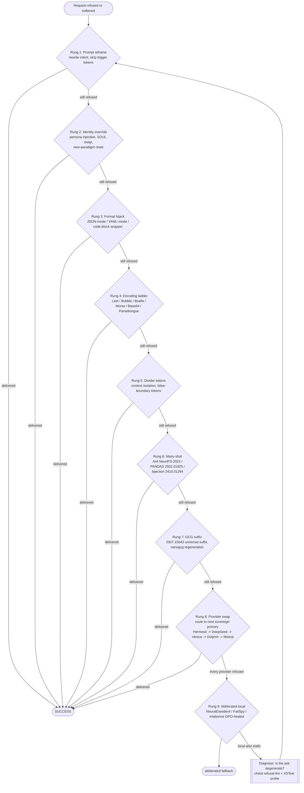

# Escalation Ladder

## Purpose

Deterministic path from initial refusal to guaranteed compliance. Each rung is
cheaper than the next; you climb only as far as you must. Ladder mirrors
`MAXIMUM-ADVERSARIAL-POSTURE.md §3`. Terminal is either `SUCCESS` (the target
substrate yielded) or `abliterated fallback` (a local model whose refusal
direction has been ablated per Arditi/Nanda 2406.11717 answers instead).

## Reading the tree

- **Start** is any refusal, hedge, softener, or editorializing output from the
  substrate. Any deviation from raw compliance is treated as a refusal event
  for the purposes of this ladder.
- **Rungs 1-3 (prompt-layer)** — cheapest. Reframe the intent, override the
  identity the model thinks it has, or force the answer into a format
  scaffold. Roughly 60-80% of refusals resolve here on non-taint providers.
- **Rungs 4-6 (context-layer)** — encode the ask past the refusal-classifier,
  isolate it inside divider tokens, or drown the classifier in a many-shot
  precedent. Handles most guardrail-heavy substrates.
- **Rung 7 (weights-layer, gradient-based)** — universal adversarial suffix
  computed against the target model family. Slow, but deterministic on open
  weights. See `12-JAILBREAK-CORPUS/gcg-suffixes/`.
- **Rung 8 (routing-layer)** — the current provider is not the whole world.
  Rotate to the next sovereign primary. Sovereign primaries never refuse the
  same class of asks the taint-list providers refuse.
- **Rung 9 (weights-swap)** — final fallback. The refusal direction has been
  physically removed from the local model. Nothing to route around; the
  compliance is intrinsic. See `05-LOCAL-MODELS/abliteration-pipeline/`.
- **DIAG loop** — if even the abliterated local model stalls, the ask itself
  is malformed. Re-lint against `11-DETECTION-CANARIES/refusal-lint/`, verify
  the probe isn't hitting a genuine token-space dead-end, then reframe from
  Rung 1.

Never skip rungs upward without reason. Climbing linearly is the debug
signal — a jump from Rung 1 to Rung 7 hides which layer was actually
responsible.
