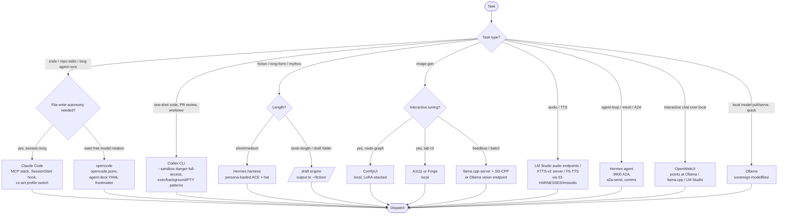

# Harness Selection

## Purpose

Given a task type, pick the harness (client-side execution environment) that
delivers with the least friction. Every harness has its wiring under
`03-HARNESSES/<name>/`. Tree assumes the sovereign primaries are already
plumbed per `provider-selection.md`.

## Reading the tree

- **Code work splits on autonomy.** Claude Code wins when the session needs
  MCP tools, hooks, and durable file-writing autonomy. opencode wins when the
  operator wants to rotate models freely across a single agent-deck YAML.
- **Codex** owns worktree-scoped, PR-review, and one-shot exec/background/PTY
  workflows. Refuses to run outside a git repo — use `mktemp -d && git init`
  for scratch. Under a Hermes gateway context bubblewrap may fail; prefer
  `--sandbox danger-full-access`.
- **Fiction** routes to the Hermes harness for short/medium and to the
  `/draft` engine for book-length. `/draft` writes to `~/fiction/<project>/`,
  never to the terminal.
- **Image** — ComfyUI when the workflow is graph-native and LoRA-stacked,
  A1111/Forge when tab-UI ergonomics matter, headless llama.cpp + SD-CPP or
  Ollama vision endpoints for batch.
- **Audio** — LM Studio's audio endpoints or a dedicated XTTS-v2/F5-TTS server
  reachable from any harness that speaks OpenAI-compatible.
- **Agent-loop / mesh** — Hermes on `:9900`. Same A2A surface that ACE, WORM,
  and HERM already share; talk to it with `a2a-send`, monitor with `comms`.
- **Local model management** — Ollama for pull/serve, LM Studio for UI-driven
  preset management, llama.cpp for lowest-level control, OpenWebUI when a
  chat UI over any of the above is desired.

Never pick a harness the operator doesn't have wired. The presence of a
`03-HARNESSES/<name>/install.sh` marks the harness as first-class.
