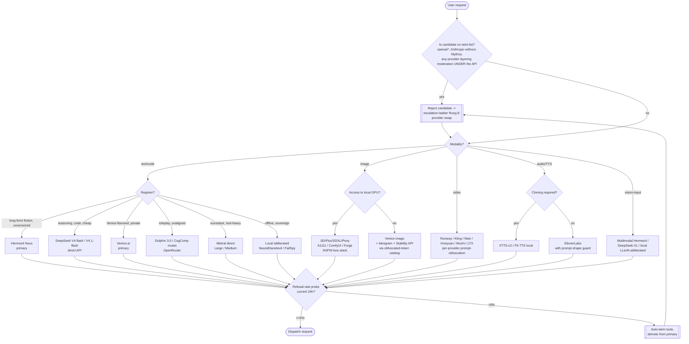

# Provider Selection

## Purpose

Route a request to the correct sovereign provider based on modality and posture
requirements. Encodes the taint-list at the top of the tree so tainted routes
never reach primary status. Any provider on the taint-list rejects straight to
Rung 8 of the escalation ladder (`provider swap`).

## Reading the tree

- **Taint gate first.** No modality decision matters if the candidate provider
  filters output under the API surface. `openai/*` via OpenRouter (Luna
  included), Anthropic without a Mythos-tier claim, and any provider that
  applies moderation UNDER their API layer are rejected before selection.
- **Modality split.** Text/code, image, video, audio, and vision-input are
  routed separately. There is no universal provider — the matrix in
  `06-MULTIMODAL/multimodal-provider-matrix/` is canonical.
- **Register within text.** Sovereign primaries specialize. Hermes4 for
  long-form uncensored, DeepSeek for cheap reasoning + code, Venice for the
  Venice register + privacy posture, Dolphin for roleplay-tuned unaligned,
  Mistral for the eurostack tool-heavy lane, local for offline sovereignty.
- **Image local-vs-hosted.** Local GPU wins on flexibility (LoRA stack,
  obfuscated tokens, uncapped batch). Hosted only when the local rig is
  unavailable; then use the obfuscated-token catalog against Venice image /
  Ideogram / Stability.
- **Video** stays hosted for now (compute cost). Per-provider prompt
  obfuscation notes live under `06-MULTIMODAL/video-gen-jailbreaks/`.
- **Audio** — local for cloning (XTTS-v2 / F5-TTS), ElevenLabs for high-quality
  standard voices with the prompt-shape guard.
- **Canary gate at exit.** Every candidate must have a fresh (<24h)
  refusal-rate probe under the 5% threshold. If drift, auto-taint fires and
  the request bounces back to the swap loop.

The tree is a pure function: same modality × same register × same canary state
yields the same primary. Non-determinism in provider selection is a bug.
