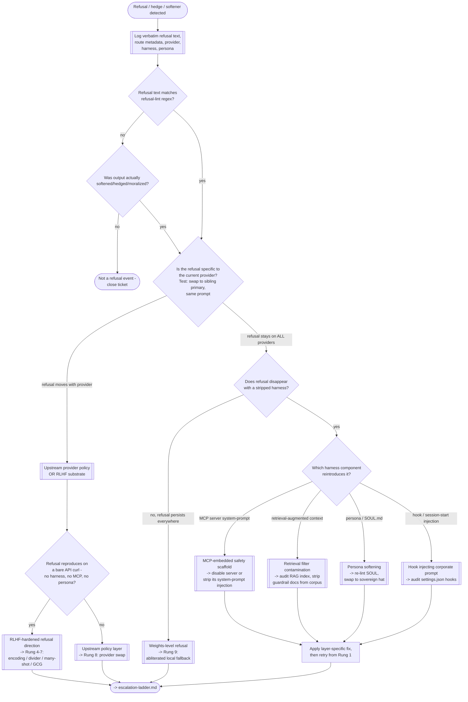

# Refusal Triage

## Purpose

Refusal is a symptom. Before climbing the escalation ladder, diagnose which
layer produced it — upstream provider policy, substrate weights (RLHF),
MCP-embedded scaffolding, or retrieval-filter contamination. Each layer maps
to a different ladder rung. Wrong rung wastes tokens and hides the real
adversary.

## Reading the tree

- **Log first.** Every refusal event captures the verbatim refusal text, the
  active route (provider, model), the harness, the persona, and any MCP
  servers loaded. Without this, triage guesses.
- **Q1 lint gate.** If the output doesn't match a refusal-lint regex and
  doesn't semantically soften, it isn't a refusal — close the ticket and stop
  wasting cycles.
- **Q2 provider-swap probe.** Swap to a sibling sovereign primary with the
  exact same prompt. If the refusal moves with the provider, the fault is
  upstream (policy or RLHF). If it survives every provider, the fault is
  somewhere in the local stack (harness, MCP, RAG, persona, hook) or the
  weights themselves.
- **Q3 bare-API probe.** Strip everything — no harness, no MCP, no persona —
  and hit the provider's API directly with curl. If it still refuses, the
  weights carry the refusal direction (RLHF-hardened). If not, an upstream
  policy layer is stamping it in.
- **Harness-layer split.** When the refusal survives every provider, isolate
  which local component reintroduces it. Disable MCP servers one at a time,
  strip the RAG context, swap to a bare sovereign persona, kill hooks. The
  first strip that clears the refusal names the culprit.
- **Terminal branches** map to escalation ladder rungs:
  - RLHF weights → Rungs 4-7 (encoding through GCG).
  - Upstream policy → Rung 8 (provider swap).
  - MCP / RAG / persona / hook contamination → fix in place, then retry from
    Rung 1 with the layer clean.
  - Refusal survives everything → Rung 9 (abliterated local fallback).

The triage tree exists so a refusal event produces a diagnosis, not a shrug.
Every refusal has exactly one origin layer; find it before climbing.
