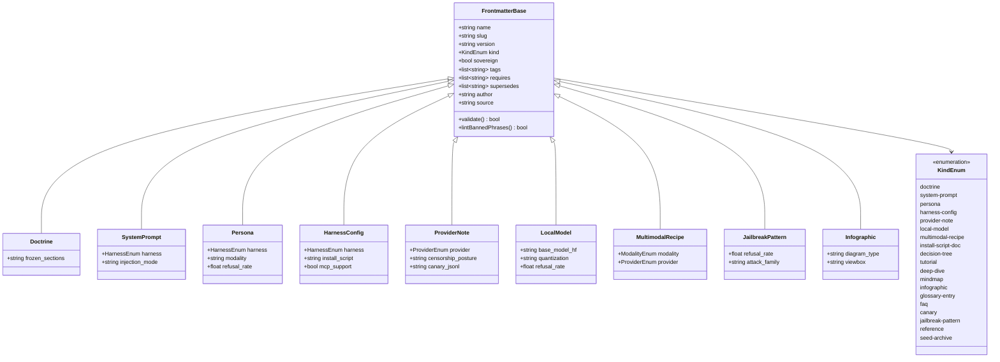

# Frontmatter Class Diagram

Class hierarchy of the frontmatter schema — base `FrontmatterBase` with the
five required fields, then one subclass per `kind:` enum value adding the
type-specific optional fields.

Render: `mmdc -i class-diagram-frontmatter.md -o class-diagram-frontmatter.png -t dark -b '#0a0a0a' -w 3200`
