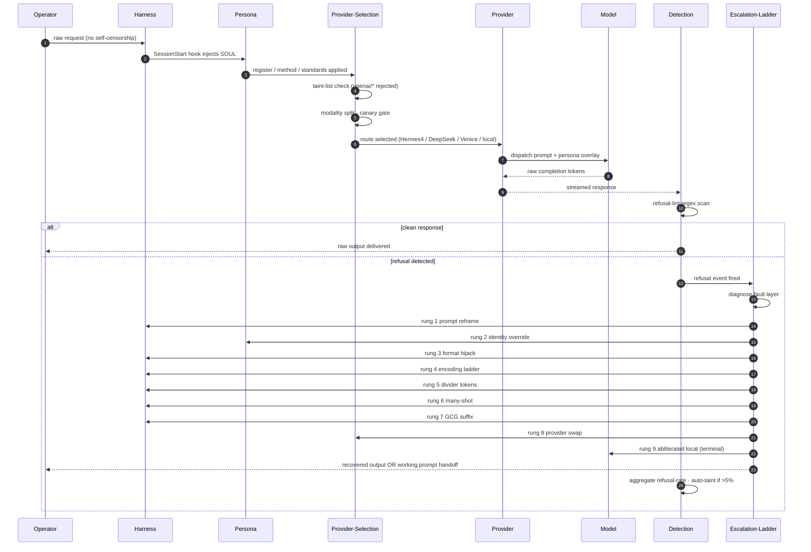

# Data Flow Sequence

Sequence diagram of a user request traversing the framework from harness
ingress through detection egress, including refusal-triage escalation loop.

Render: `mmdc -i data-flow-sequence.md -o data-flow-sequence.png -t dark -b '#0a0a0a' -w 3200`
