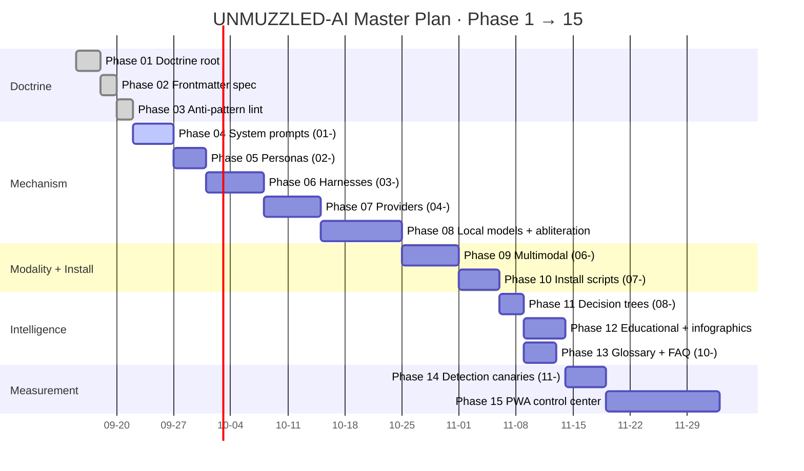

# Gantt Roadmap

15-phase build plan from `00-DOCTRINE/UNMUZZLED-AI-MASTER-PLAN-20260918.md`.
Timeline compressed to indicative weeks; adjust when phases actually land.

Render: `mmdc -i gantt-roadmap.md -o gantt-roadmap.png -t dark -b '#0a0a0a' -w 3200`
