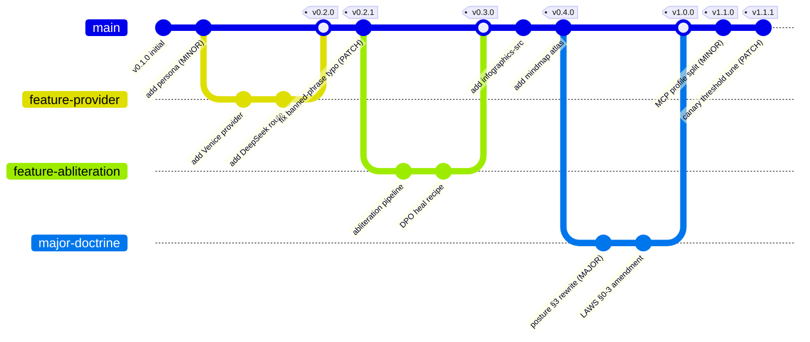

# Versioning Git Graph

Semver bump conditions per `00-DOCTRINE/VERSIONING.md`. Shows PATCH/MINOR/MAJOR
triggers as a gitGraph.

## Bump rules (from VERSIONING.md)

- **MAJOR** — change to LAWS §§0–3, MAXIMUM-ADVERSARIAL-POSTURE §Posture, or frontmatter required-field set. Requires explicit operator directive.
- **MINOR** — new folder, new kind enum value, new provider/harness/persona, new banned-phrase entry, new infographic set.
- **PATCH** — typo fix, doc clarification, lint-rule tightening within existing catalog.

Render: `mmdc -i git-graph-versioning.md -o git-graph-versioning.png -t dark -b '#0a0a0a' -w 3200`
