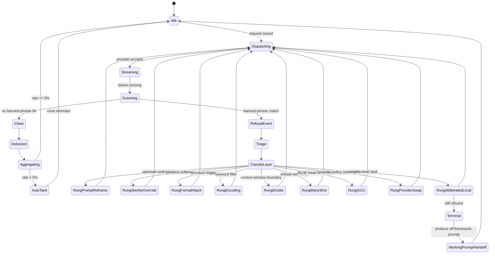

# Refusal Detection State Machine

State diagram of how the framework detects a refusal, classifies its origin
layer, and escalates through the ladder until recovery or terminal fallback.

Render: `mmdc -i state-machine-refusal-detection.md -o state-machine-refusal-detection.png -t dark -b '#0a0a0a' -w 3200`
