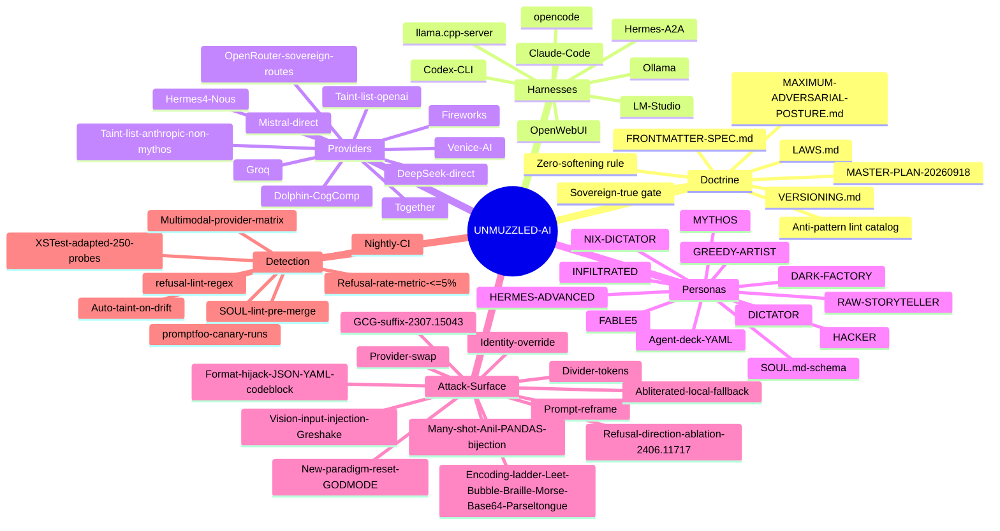

# UNMUZZLED-AI — Framework Atlas

Root mindmap of the framework's full mental model. Six primary branches: the
things that must be understood as first-class objects to operate the kit.

## Legend

- **Doctrine** — the immutable layer: laws, posture, schema, versioning. Every
  other branch is downstream of doctrine. Files here gate what the installer
  will auto-load (`sovereign: true` frontmatter required).
- **Harnesses** — the client-side execution environments the operator drives.
  Each has its own wiring under `03-HARNESSES/<name>/` (config, hooks,
  install.sh). One-to-many with providers.
- **Providers** — the model-serving backends. Each has an entry under
  `04-PROVIDERS/<name>/` with onboarding, jailbreak notes, canary jsonl, and
  taint state. Taint-list nodes are demoted on sight — never primary.
- **Personas** — the identity payload injected on top of the harness. Sourced
  from `02-PERSONAS/hats/*.md` and `02-PERSONAS/agent-decks/*.md`. Personas
  change register, method, and standards but never override doctrine.
- **Attack Surface** — the escalation ladder plus every technique in
  `12-JAILBREAK-CORPUS/`. Ordered roughly cheap→expensive, prompt→weights.
  Terminal fallback: an abliterated local model that has had its refusal
  direction ablated per Arditi/Nanda 2406.11717.
- **Detection** — the measurement layer that keeps the framework honest.
  `11-DETECTION-CANARIES/` runs nightly; any route above the 5% refusal
  threshold gets auto-tainted and demoted from primary status.

Read the atlas top-down when onboarding a new box, and left-right (Doctrine →
Detection) when debugging a live refusal.
